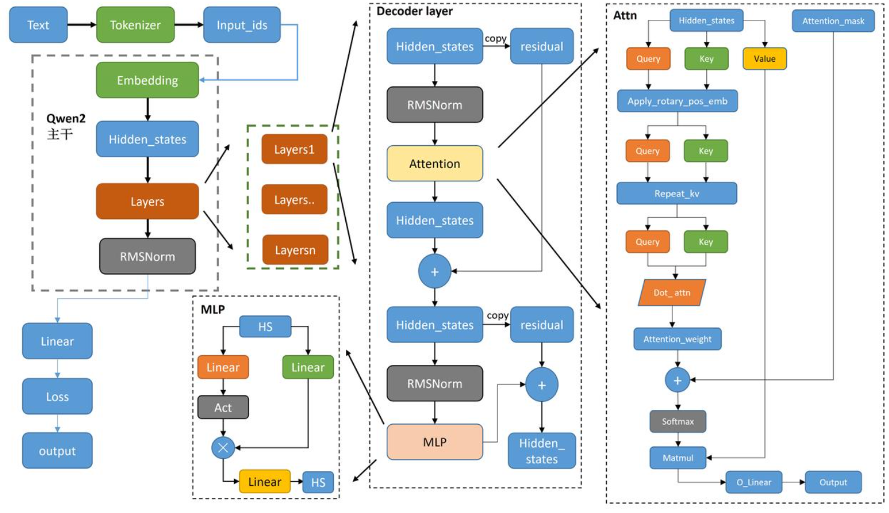

# LLama3模型讲解

参考：

https://meeting.tencent.com/user-center/shared-record-info?id=0be29bb2-0648-4aeb-9baa-c9dc91dfc7a6&from=3&is-single=false&record_type=2

https://zhuanlan.zhihu.com/p/694072728

https://blog.csdn.net/qq_51957239/article/details/139065828



Llama模型与GPT类似，也是采用了基于解码器的架构。从模型架构上LLaMA 3和LLaMA 2基本没有区别，同样使用了Transformer的Decoder-only架构。


## RMSNorm

- **为了增强训练稳定性，采用前置的RMSNorm作为层归一化方法**

$$
\overline{a_i} = \frac{a^i}{RMS(a)}g_i
$$

$$
RMS(a) = \sqrt[2]\frac{1}{n}\sum_1^na_i^2
$$


> RMSNorm是在Layer Norm之上的改进，它通过舍弃中心不变性来降低计算量。

​		采用 RMSNorm 技术进行预归一化能帮助LLM识别出文本中哪些部分对于理解上下文及其语义更为重要。它通过为关键要素赋予更高权重、非关键要素赋予较低权重的方式，引导模型将注意力集中于那些对上下文的准确解读最需要的地方。

为了确保输入向量完成归一化使用 RMSNorm 公式来进行处理：

```
class TransformerBlock(nn.Module):
    def __init__(self, dim, num_heads):
        super().__init__()
        self.attention = nn.MultiheadAttention(dim, num_heads)
        self.feed_forward = nn.Sequential(
            nn.Linear(dim, 4 * dim),
            nn.GELU(),
            nn.Linear(4 * dim, dim)
        )
        self.norm1 = RMSNorm(dim)
        self.norm2 = RMSNorm(dim)

    def forward(self, x):
        # 自注意力
        attn_output, _ = self.attention(x, x, x)
        x = x + attn_output
        x = self.norm1(x)

        # 前馈网络
        ff_output = self.feed_forward(x)
        x = x + ff_output
        x = self.norm2(x)

        return x
        
        
# 创建一个使用RMSNorm的Transformer块
block = TransformerBlock(dim=512, num_heads=8)

# 创建一个随机输入张量
x = torch.randn(32, 10, 512)  # [batch_size, seq_len, dim]

# 前向传播
output = block(x)

print(output.shape)  # 应该输出 torch.Size([32, 10, 512])
```


## SwiGLU激活函数

- **为了提高模型性能，采用SwiGLU作为激活函数**

$$
SwiGLU(x,W,V,b,c,\beta) = Swish_\beta(xW+b)\bigotimes(xV+c)
$$

SwiGLU激活函数是一种用于神经网络的非线性激活函数。它是由Google研究人员于2020年提出的一种激活函数，旨在改进神经网络的表示能力和学习能力。SwiGLU激活函数的主要思想是引入一个门控机制，用于控制输入信号在激活函数中的传递方式。它由两个部分组成：GLU和Swish函数。

- GLU部分接受输入信号并执行门控操作，其目的是对输入信号进行筛选和选择性放大。它由一个sigmoid激活函数作为门控器，将输入信号转换为范围在0和1之间的值。这个值可以被解释为对输入信号的重要性或影响程度。然后，GLU将输入信号与门控值相乘，以便选择性地放大或抑制输入。

- Swish部分是一个非线性函数，将输入信号进行非线性变换。Swish函数定义为 x * sigmoid(x)。Swish函数的特点是在输入为正数时逐渐趋向于线性变换，而在输入为负数时则具有非线性的抑制效果。

**在生成文本之前，SwiGLU 会根据每个单词（word）或短语与上下文的相关性调整其重要性（importance）。**

实现：

```
#创建SwiGLU类
import torch
import torch.nn as nn
import torch.nn.functional as F

class SwiGLU(nn.Module):
    def __init__(self, in_features, hidden_features=None, out_features=None, bias=True):
        super().__init__()
        out_features = out_features or in_features
        hidden_features = hidden_features or in_features
        self.w1 = nn.Linear(in_features, hidden_features, bias=bias)
        self.w2 = nn.Linear(in_features, hidden_features, bias=bias)
        self.w3 = nn.Linear(hidden_features, out_features, bias=bias)

    def forward(self, x):
        x1 = self.w1(x)
        x2 = self.w2(x)
        x1 = F.silu(x1)  # SiLU is equivalent to Swish with beta=1
        out = x1 * x2
        out = self.w3(out)
        return out

# 使用示例
in_features = 512
hidden_features = 2048
out_features = 512

swiglu = SwiGLU(in_features, hidden_features, out_features)

# 假设我们有一个输入张量
input_tensor = torch.randn(32, 512)  # batch_size=32, sequence_length=512

output = swiglu(input_tensor)
print(output.shape)  # 输出 torch.Size([32, 512])
```


## ROPE

ROPE是一种位置编码技术，旨在为Transformer模型注入相对位置信息。传统的Transformer模型使用位置编码来弥补自注意力机制在处理序列数据时缺乏位置信息的不足。


- **旋转编码 RoPE 可以有效地保持位置信息的相对关系**，即相邻位置的编码之间有一定的相似性，而远离位置的编码之间有一定的差异性。这样可以增强模型对位置信息的感知和利用。这一点是其他绝对位置编码方式（如正弦位置编码、学习的位置编码等）所不具备的，因为它们只能表示绝对位置，而不能表示相对位置。

- **旋转编码 RoPE 可以通过旋转矩阵来实现位置编码的外推**，即可以通过旋转矩阵来生成超过预训练长度的位置编码。这样可以提高模型的泛化能力和鲁棒性。这一点是其他固定位置编码方式（如正弦位置编码、固定相对位置编码等）所不具备的，因为它们只能表示预训练长度内的位置，而不能表示超过预训练长度的位置。

- **旋转编码 RoPE 可以与线性注意力机制兼容**，即不需要额外的计算或参数来实现相对位置编码。这样可以降低模型的计算复杂度和内存消耗。这一点是其他混合位置编码方式（如Transformer-XL、XLNet等）所不具备的，因为它们需要额外的计算或参数来实现相对位置编码。

**在处理文本的过程中，RoPE 并未简单地将位置编码视作固定、静态的（fixed and static）元素，而是巧妙地融入了旋转（rotational）这一概念，使得表示方式更加灵活、多样化，能够更精准地把握文本序列内词语间的变化关系。** 这种灵活性赋予了 ChatGPT 等模型更强的能力，使其能更深刻地理解和生成自然流畅、逻辑连贯的文本内容。


# GQA

- **为了平衡性能和准确度，采用了分组查询注意力机制（GQA）**

​	分组查询注意力模型的能力与多头注意力的的模型能力相近而且推理速度和多查询注意力相近，等同于同时融合了两者的优点，但是注意，分组查询注意力并没有减少模型的计算量，只是优化的显存的换入换出，在解码过程中由于key和value的数量级远远小于query的数量级，所以在自回归解码时可以将已经计算出来的key和value一直存储在高速缓存中，减少数据换入换出的次数，以此来提升速度。

1. 首先将输入的token序列通过词嵌入（word embedding）矩阵转化为词向量序列。然后，词向量序列作为隐藏层状态依次通过 个解码器层，并在最后使用RMSNorm进行归一化。归一化后的隐藏层状态将作为最后的输出。


2. 在每个解码器层中，输入的隐藏层状态首先通过RMSNorm归一化然后被送入注意力模块。注意力模块的输出将和归一化前的隐藏层状态进行残差连接。之后，新的隐藏层状态进行RMSNorm归一化，然后被送入前馈网络层。类似地，前馈网络层的输出同样进行残差连接，作为解码器层的输出。

